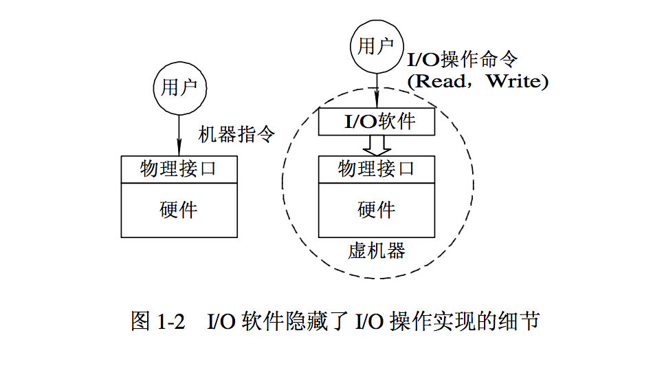
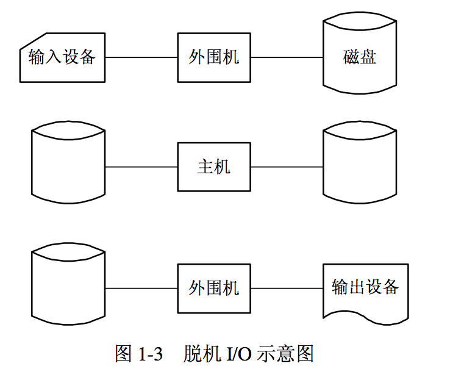
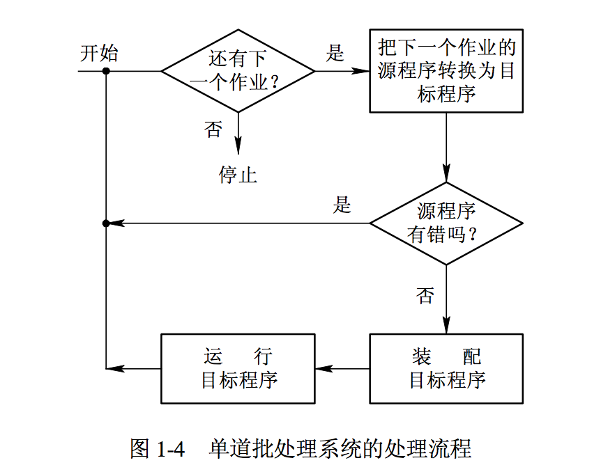
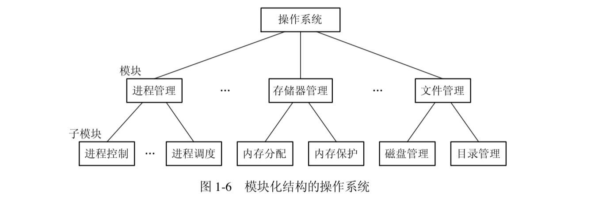
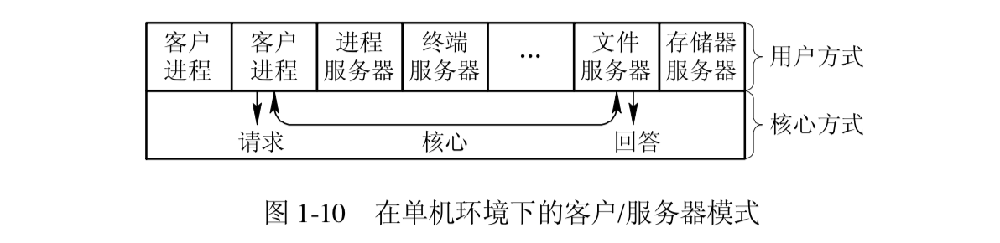
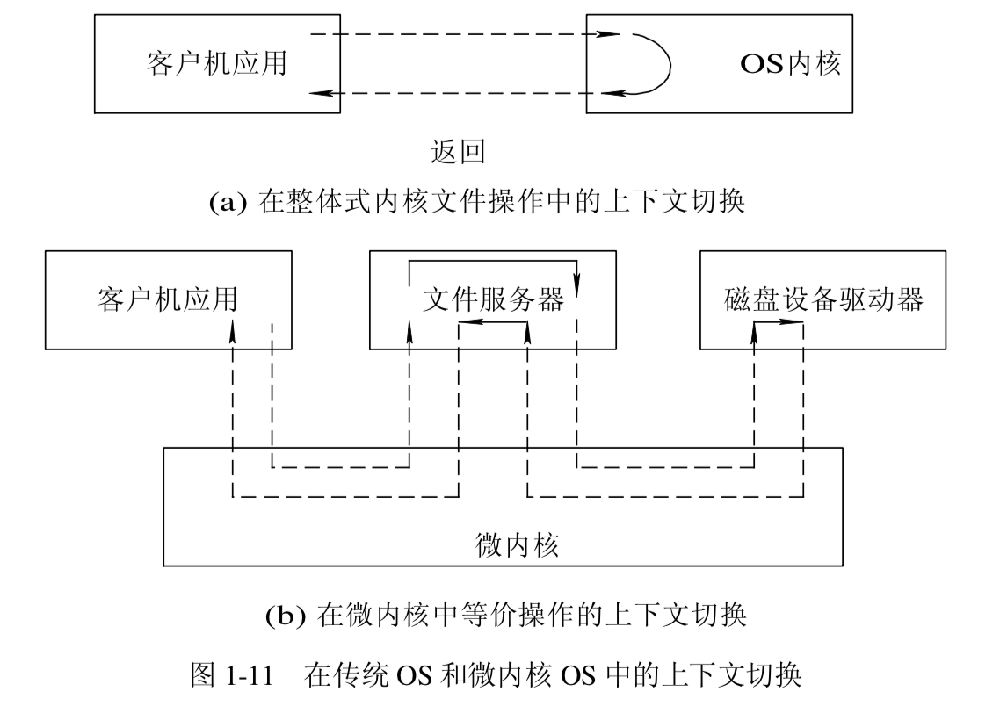

# 操作系统(01)--概论

Operating System是配置在计算机硬件上的<mark>第一层软件</mark>，是对硬件系统的首次扩充

> 操作系统是指控制和管理整个计算机系统和软件资源，并合理的组织调度计算机的工作和资源分配，以提供给用户和其它软件方便的接口和环境的程序集合

**主要作用：**

+ **管理**计算机系统和软件资源
+ 合理**组织调度**计算机的**工作和资源分配**，以提高它们的利用率和系统吞吐量
+ 为用户和应用程序提供一些简单的**接口**和**环境**

</br>

## 目标和作用

### OS目标

1. 方便性
2. 有效性
   + 提高系统资源利用率
   + 提高系统吞吐量
3. 可扩充性
4. 开放性

</br>

### OS作用

+ 作为用户与计算机硬件系统之间的接口

  

+ 作为计算机系统资源的管理者

  + 处理机管理：分配和控制处理机
  + 存储器管理：内存的分配和回收
  + I/O设备管理：I/O设备的分配（回收）与操纵
  + 文件管理：文件的存取、共享和保护

+ 实现了对计算机资源的抽象

  

  </br>

### OS发展的主要动力

1. 不断提高的计算机资源利用率

2. 方便用户

3. 器件的不断更新换代

4. 计算机体系结构的不断发展

   ```python
   # 单处理机系统发展为多处理机系统，相应的，操作系统也就由单处理机 OS 发展为多处理 OS。
   
   # 当出现了计算机网络后，配置在计算机网络上的网络操作系统应运而生，它不仅能有效地管理好网络中的共享资源，而且还向用户提供了许多网络服务。
   ```

5. 不断提出新的应用需求

</br>

------

**用户使用操作系统的方式：**

1. 系统调用

   ```python
   # OS 提供了一组系统调用，用户可在自己的应用程序中通过相应的系统调用，来实现与操作系统的通信，并取得它的服务。
   ```

2. 终端命令

   ```python
   # 这是指由OS 提供了一组联机命令接口，以允许用户通过键盘输入有关命令来取得操作系统的服务，并控制用户程序的运行。
   ```

3. 图形窗口

   ```python
   # 这是当前使用最为方便、最为广泛的接口，它允许用户通过屏幕上的窗口和图标来实现与操作系统的通信，并取得它的服务。
   ```

**计算机系统资源分类：**——多种硬件和软件资源的集合

+ 处理机
+ 存储器
+ I/O设备
+ 文件(数据和程序)

</br>

## 发展过程

### 无操作系统的计算机系统

1. 人工操作方式

   ```python
   # 缺点
   """
   1.用户独占全机
   2.CPU等待人工操作
   """
   ```

2. 脱机输入/输出方式(Off-Line I/O)

   

   ```python
   # 优点
   """
   1）减少了 CPU 的空闲时间。装带卸带以及将数据从低速 I/O设备送到高速磁带上，都是在脱机情况下进行的，并不占用主机时间，从而有效地减少了 CPU 的空闲时间，缓和了人机矛盾。
   
   2）提高了 I/O 速度。当 CPU 在运行中需要数据时，是直接从高速的磁带上将数据调入内存的，不再是低速 I/O 设备上输入，极大地提高了 I/O 速度，从而缓和了 CPU 和 I/O 设备速度不匹配的矛盾，进一步减少了 CPU 的空闲时间。
   """
   ```

</br>

### 单道批处理系统

**Simple Batch Processing System的处理过程：**



------

**单道批处理系统的特征：**

1. 自动性
   + 在顺利情况下，在磁带上的一批作业能自动地逐个地依次运行，而无需人工干预。
2. 顺序性
   + 在磁带上的各道作业是顺序地进入内存，各道作业的完成顺序与它们进入内存的顺序，在正常情况下完全相同，亦即先调入内存的作业先完成。
3. 单道性
   + 内存中仅有一道程序运行，即监督程序每次从磁带上只调入一道程序进入内存运行，当该程序完成或发生异常情况时，才换入其后继程序进入内存运行。

------

**单道批处理系统的缺点：**系统中的资源得不到充分的利用

```python
# 因为在内存中仅有一道程序，每逢该程序发出I/O请求后，CPU便处于等待状态，必须在其I/O完成后才能继续运行。

# I/O设备的低速性，更使得CPU的利用率显著降低
```

</br>

### 多道批处理系统

**Multiprogrammed Batch Processing System的基本概念：**

```python
# 作业调度程序按一定的算法从后备队列中选择若干个作业调入内存，使它们共享 CPU 和系统中的各种资源
```

1. 后备队列  <!--在该系统中，用户所提交的作业都先存放在外村上并排成一个队列--> 

2. 作业调度程序

3. 共享CPU和系统中的各种资源

```python
# I/O操作——》CPU空挡期——》多道程序交替运行——》保持CPU处于忙碌状态
```

------

**多道批处理系统的优点：**

1. 资源利用率高
   + CPU利用率：多道程序交替运行
   + 内存利用率：内存中装入多道程序
   + I/O设备利用率
2. 系统吞吐量大
   + CPU和其它资源保持”忙碌“状态
   + 仅当作业完成时或运行不下去时才进行切换，系统开销小

------

**多道批处理系统的缺点：**

1. 平均周转时间长

   ```python
   # 作业的周转时间是指从作业进入系统开始，直至其完成并退出系统为止所经历的时间。在批处理系统中，由于作业要排队，依次进行处理，因而作业的周转时间较长，通常需几个小时，甚至几天。
   ```

2. 无交互能力

------

**多道批处理系统仍需解决的问题：**为了使系统中的多道程序能协调地运行

1. 处理机争用问题
2. 内存分配和保护问题
3. I/O设备分配问题
4. 文件的组织和管理问题
5. 作业管理问题
6. 用户与系统的接口问题

</br>

### 分时系统

**Time Sharing System的产生：**

1. 便于人——机交互

2. 可以共享主机

   ```python
   # 用户们在共享一台计算机时，每个人都希望能像独占时一样，不仅可以随时与计算机交互，而且还不会感觉到其它用户的存在
   ```

3. 便于用户上机

------

**分时系统实现中的关键问题：**

1. 及时接收

   + 要及时接收用户键入的命令，只需在系统中配置一个**多路卡**。多路卡的作用是使主机能同时接收各用户从终端上输入的数据。

2. 及时处理：人机交互的关键，是使用户键入命令后能及时地控制自己作业的运行，或修改自己的作业。

   + 作业直接进入内存

   + 采用轮转运行方式——时间片 

     ```python
     # 系统规定每个作业每次只能运行一个时间片，然后就暂停该作业的运行，并立即调度下一个作业运行
     ```

------

**分时系统的特征：**

1. 多路性 

   ```python
   # 允许在一台主机上同时连接多台联机终端，系统按分时原则为每个用户服务。多路性即同时性，它提高了资源利用率，降低了使用费用，从而促进了计算机更广泛的使用。
   ```

2. 独立性 

   ```python
   # 每个用户各占一个终端，彼此独立操作，互不干扰
   ```

3. 及时性

   ```python
   # 用户的请求能在很短时间内获得响应
   ```

4. 交互性

   ```python
   # 用户可通过终端与系统进行广泛的人机对话, 其广泛性表现在：用户可以请求系统提供多方面的服务，如：文件编辑，数据处理和资源共享等
   ```

</br>

### 实时系统

Real Time System是指系统能**及时响应外部事件的请求**，**在规定的事件内完成对该事件的处理**，并控制所有实时任务协调一致的运行。

**应用需求：**

1. 实时控制
2. 实时信息处理

------

**实时任务：**

1. 按任务执行是否周期性来划分——开始截止时间&&完成截止时间

   + 周期性实时任务

     ```python
     # 外部设备周期性地发出激励信号给计算机，要求它按指定周期循环执行，以便周期性地控制某外部设备。
     ```

   + 非周期性实时任务

     ```python
     # 外部设备发出的激励信号并无明显周期，但都联系着一个截止时间。
     ```

2. 根据对截止时间的要求来划分

   + 硬实时任务

     ```python
     # 系统必须满足对截止时间的要求，否则可能出现难以预测的结果。
     ```

   + 软实时任务

     ```python
     # 它也联系着一个截止时间，但并不严格，若偶尔错过了任务的截止时间，对系统产生的影响也不会很大。
     ```

------

**实时系统与分时系统特征的比较：**

| 比较项 |                           实时系统                           |                           分时系统                           |
| :----: | :----------------------------------------------------------: | :----------------------------------------------------------: |
| 多路性 | 实时控制系统的多路性主要表现在系统周期性地对多路现场信息进行采集，以及对多个对象或多个执行机构进行控制 |        分时系统中的多路性则与用户情况有关，时多时少。        |
| 独立性 | 实时控制系统中，对信息的采集和对对象的控制也都是彼此互不干扰的 | 信息查询系统中的每个终端用户在与系统交互时，彼此相互独立互不干扰 |
| 及时性 | 实时控制系统的及时性，则是以控制对象所要求的开始截止时间或完成截止时间来确定的，一般为秒级到毫秒级，甚至有的要低于100微秒。 | 信息查询系统对实时性的要求与分时系统类似，都是以人所能接受的等待时间来确定的 |
| 交互性 | 具有交互性，但这里人与系统的交互仅限于访问系统中某些特定的专用服务程序 |    分时系统那样能向终端用户提供数据处理和资源共享等服务。    |
| 可靠性 | 实时系统则要求系统具有高度的可靠性。因为任何差错都可能带来巨大的经济损失，甚至是无法预料的灾难性后果，所以在实时系统中，往往都采取了多级容错措施来保障系统的安全性及数据的安全性。 |                     分时系统要求系统可靠                     |

</br>

### 微机操作系统

配置在微机上的操作系统称为微机操作系统

+ 单用户单任务操作系统
+ 单用户多任务操作系统
+ 多用户多任务操作系统

</br>

## 基本特性

**四大基本特性：**<mark>并发、共享、虚拟、异步</mark>

### 并发

**并发与并行：**

**并行性**是指两个或多个事件在**同一时刻发生**；**并发性**是指两个或多个事件在**同一时间间隔内发生**。

```python
# 倘若在计算机系统中有多个处理机，这些可以并发执行的程序便可以被分配到多个处理机上，实现并行执行
```

------

**引入进程：**

**进程**：

+ 能独立运行的活动实体（运行中的程序）
+ 资源分配的基本单位
+ 机器指令、数据和堆栈等的集合

**程序：**

+ 静态实体

事实上可以在内存中存放多个用户程序，分别为它们建立进程后，这些程序可以**并发执行**，亦即实现多道程序运行。这样能极大提高系统资源的利用率，增加系统的吞吐量。

------

**引入线程：**

通常在**一个进程中可以包含若干个线程**，它们可以利用进程所拥有的资源。在引入线程的 OS 中，通常都是把进程作为**分配资源的基本单位**，而把线程作为**独立运行和独立调度的基本单位**。

</br>

### 共享

在操作系统环境下，共享是指系统中的**资源可供内存中多个并发的进程功能使用**，相应地，把这种资源共同使用成为资源共享，或成为资源复用。

```python
# 这里宏观上限定了时间（进程在内存期间），也限定了地点（内存）
```

**解决共享资源的争夺问题：**

+ 互斥共享方式——在一段时间内，只允许一个进程访问该资源

  ```python
  # 独占资源（临界资源）： 在一段时间内只允许一个进程访问的资源
  
  # 如系统中大多数物理设备，以及栈、变量和表格
  ```

+ 同时访问方式

  ```python
  # 允许在一段时间内由多个进程“同时”进行访问的资源
  
  # “同时”是指宏观上的；微观上，这些进程对该资源的访问是交替进行的
  
  # 如可供多个进程‘同时’访问的磁盘设备
  ```

</br>

### 虚拟

操作系统中的所谓“虚拟”，是指通过某种技术<mark>把一个物理实体变为若干个逻辑上的对应物。</mark>物理实体是实的，即实际存在的，而后者是虚的，近视用户感受上的东西。

操作系统中利用了两种方式实现虚拟技术，即**时分复用技术**和**空分复用技术**。

**时分复用技术：**

多道程序技术（时分复用技术）是<mark>通过利用**处理机的空闲时间**来运行其它程序，提高了处理机的利用率</mark>

+ 虚拟机处理技术
  + 利用多道程序设计技术，为每道程序建立至少一个进程，让多到程序并发执行。此时系统中虽然只有一台处理机，但通过分时复用的方法，能实现同时（宏观上）为多个用户服务，使每个终端用户都认为是有一个处理机在专门为他服务
+ 虚拟设备技术

------

**空分复用技术：**

空分复用技术是<mark>利用**存储器的空闲空间**分区域存放和运行其它程序，提高内存的利用率</mark>

但是单纯的空分复用存储器只能提高内存的利用率，并不能实现在逻辑上的扩大存储器的容量的功能，还必须引入虚拟存储技术

虚拟存储技术本质是实现内存的分时复用，即它可以通过分时复用内存的方式，使一道程序仅在小于它的内存空间中运行。——置换功能：`每次只把用户程序的一部分调入内存运行，运行完成后将该部分换出，再换入另一部分到内存中运行`

+ 虚拟磁盘技术
+ 虚拟存储器技术

一般情况下是：`空分复用技术 + 虚拟存储技术`

</br>

### 异步

进程是以人们不可预知的速度向前推进，此即进程的异步性。但只要在操作系统中配置有完善的进程同步机制，且运行环境相同，作业经多次运行都会获得完全相同的结果。因此，异步运行方式是允许的，而且是操作系统的一个重要特征。

</br>

## 主要功能

### 处理机管理功能

**主要任务：**1）对进程进行管理

#### 进程控制

**主要任务：**1）为作业创建进程。2）撤销已结束的进程。3）控制进程在运行过程中的状态转换。

#### 进程同步

**主要任务：**为多个进程的运行进行协调

**两种协调方式：**

1. 进程互斥方式：指诸进程在对临界资源进行访问时，应采用互斥方式
2. 进程同步方式：指在**相互合作**去完成功能任务的诸进程间，由**同步机构**对他们的**执行次序**加以协调

#### 进程通信

**主要任务：**实现相互合作的进程之间的信息交换。

当相互合作的进程处于同一计算机系统时，通常在它们之间采用**直接通信方式**，即由**源进程**利用**发送命令**直接将**消息（message）**挂到**目标进程**的**消息队列**上，以后由**目标进程**利用**接收命令**从其**消息队列**中取出消息。

当相互合作的进程不属于同一计算机系统时（网络上的两个进程），通常采用**网络通信**。

#### 调度

**主要任务：**1）作业调度。2）进程调度。

+ 作业调度
  + 作业调度的基本任务是从**后备队列**中按照一定的算法，选择出若干个**作业**，为他们**分配运行所需的资源**。在将他们**调入内存后**，便分别为他们**建立进程**，使他们都成为可能获得处理机的**就绪进程**，并按照一定的算法将他们插入**就绪队列**。
+ 进程调度
  + 进程调度的任务是从进程的**就绪队列**中，按照一定的算法**选出一个进程**，**把处理机分配**给它，并为它设置运行现场，使进程投入执行。
  + 值得提出的是，在多线程OS中，通常是把线程作为独立运行和分配处理机的基本单位，为此，须把就绪线程排成一个队列，每次调度时，是从就绪线程队列中选出一个线程，把处理机分配给它。

</br>

### 存储器管理功能

**主要任务：**1）为多道程序提供良好的运行环境。2）提高存储器利用率。3）从逻辑上扩充内存。

#### 内存分配

**主要任务：**1）为每道程序分配内存空间。2）提高存储器的利用率，尽量减少不可用的内存空间（碎片）。3）允许正则允许的程序申请附加内存空间，以适应程序和数据动态增长的需求。

**内存分配方式：**

1. 静态分配
   + 每个作业的内存空间时确定的（作业装入时），不允许作业申请附加内存空间，不允许作业在内存中的“移动”
2. 动态分配
   + 允许作业在运行过程中申请附加内存空间，允许作业在内存中“移动”

**为了实现内存分配，在内存分配的机制中应具有这样的结构功能：**

1. **内存分配数据结构**。该结构用于<mark>记录内存空间的使用情况</mark>，作为内存分配的依据。
2. **内存分配功能**。系统按照一定的内存分配算法为用户程序分配内存空间。
3. **内存回收功能**。系统对用用户不再需要的内存，通过用户的释放请求去完成系统的回收功能。

#### 内存保护

**主要任务：**1）内存保护的主要任务是确保每道用户程序都只在自己的内存空间内运行，彼此互不干扰。2）决不允许用户程序访问操作系统的程序和数据。3）决不允许用户程序转移到非共享的其他用户程序中去执行。

一种比较简单的内存保护机制：

```python
# 设置两个界限寄存器，分别用于存放正在执行程序的上界和下界。在程序运行时，系统须对每条指令所要访问的地址进行检查，如果发生越界，便发出越界中断请求，以停止该程序的执行。
```

#### 地址映射

**主要任务：**1）将**地址空间的逻辑地址**转换为**内存空间中与之对应的物理地址**

#### 内存扩充

**主要任务：**1）并非是从物理上去扩大内存的容量，而是借助于虚拟存储技术，从逻辑上扩充内存容量。

**内存扩充必备功能：**

1. 请求调入功能
   + 允许在装入一部分用户程序和数据的情况下，便能启动该程序运行。
   + 在程序运行过程中，若发现要继续运行时所需的程序和数据尚未装入内存，可向OS发出请求，由**OS从磁盘中将所需部分调入内存，以便继续运行**。
2. 置换功能
   + 若发现在内存中<u>已无足够的空间</u>来装入需要调入的程序和数据时，系统应能<mark>将内存中的一部分暂时不用的程序和数据调至盘上，以腾出内存空间，然后再将所需调入的部分装入内存。</mark>

</br>

### 设备管理功能

**主要任务：**1）完成用户进程提出的 I/O 请求。2）为用户进程分配所需的 I/O 设备。3）提高 I/O 设备和 CPU 的利用率。4）提高 I/O 速度。5）方便用户使用 I/O 设备。

#### 缓冲管理

如果在I/O设备和CPU之间引入缓冲，则可以有效地缓和CPU和I/O设备速度不匹配的矛盾，提高CPU的利用率，进而提高系统吞吐量。

OS在内存中设置了缓重区，可通过增加缓冲区容量的方法来改善系统的性能。

**常见缓冲区机制：**（这些缓冲区都由OS缓冲管理机制管理）

+ 单缓冲机制
+ 双缓冲机制：能实现双向同时传送数据
+ 缓冲池机制：能供多个设备同时使用

#### 设备分配

是根据用户进程的 I/O 请求、系统的现有资源情况以及按某种设备的分配策略，为之分配其所需的设备。

**实现设备分配：**

1. 设备控制表
2. 控制器控制表
3. 用于记录设备及控制器等的标识符和状态表

#### 设备处理

设备处理程序（设备驱动程序），用于实现CPU和设备控制器之间的通信。

**设备处理过程：**

1. 检查I/O请求的合法性
2. 了解设备状态（是否空闲）
3. 读取有关的传递参数及设置设备的工作方式
4. 向设备控制器发出I/O命令
5. 启动I/O设备完成指定的I/O操作

#### 虚拟设备

使用虚拟技术

</br>

### 文件管理功能

**主要任务：**1）对用户文件和系统文件进行管理，以方便用户使用。2）保证文件的安全性。

#### 文件存储空间的管理

为每个文件分配必要的外存空间，提高外存利用率，并能有助于提高文件系统的存、取速度。

**实现文件存储空间管理：**

1. 用于记录文件存储空间使用情况的数据结构
2. 对文件存储空间进行分配的功能
3. 对文件存储空间进行回收的功能

#### 目录管理

为每个文件建立其目录项，并对众多的目录项加以有效的组织，以实现方便的按名存取，即用户只需提供文件名便可对该文件进行存取。

**目录管理额外功能：**

1. 文件共享功能——只需在外存上保留一份该共享文件的副本
2. 快速的目录查询功能——提高对文件的检索速度

#### 文件的读/写管理和保护

**文件的读/写管理：**根据用户的请求，从外存中读取数据，或将数据写入外存。

**文件保护：**1）防止未经核准的用户存取文件。2）防止冒名顶替存取文件。3）防止以不正确的方式使用文件。


</br>

### 操作系统与用户之间的接口

#### 用户接口

它是提供给用户使用的接口，用户可通过该接口取得操作系统的服务。

**用户接口分类：**

1. 联机用户接口

   为联机用户提供，它由一组键盘操作命令及命令解释程序所组成。

2. 脱机用户接口

   ```python
   # 为批处理作业的用户提供的，故也称批处理用户接口。该接口由一组作业控制语言（JCL）组成。批处理作业的用户不能直接与自己的作业交互作用，只能委托系统代替用户对作业进行干预和控制。这里的作业控制语言 JCL 便是把需要对作业进行的控制和干预事先写在作业说明书上，然后将作业和作业说明书一起提供给系统。
   ```

3. 图形用户接口

   ```python
   # 图形用户接口采用了图形化的操作界面，用非常容易识别的各种图标将系统的各项功能、各种应用程序和文件，直观、逼真的表示出来。
   ```

#### 程序接口

+ 是为用户程序在执行中访问系统资源而设置
+ 是用户程序取得操作系统服务的唯一途径
+ 由一组**系统调用**组成，每一个系统调用都是一个完成了特定功能的子程序

</br>

### 现代操作系统的新功能

#### 系统安全

1. 认证技术
2. 密码技术：对系统中所需存储和传输的数据进行加密，使之成为密文。
3. 访问控制技术
4. 反病毒技术


#### 网络的功能和服务

1. 网络通信：用于源主机和目标主机之间，实现无差错的数据传输。
2. 资源管理
3. 应用互操作：在一个由若干个不同网络互连所构成的互联网中，必须提供应用互操作功能，以实现信息的互通性和互用性。

#### 支持多媒体

1. 接纳控制功能
2. 实时调度
3. 多媒体文件的存储

</br>

## OS结构设计

**传统结构：**

1. 无结构OS
2. 模块化结构OS
3. 分层式结构OS

**现代结构：**

1. 微内核结构OS

**软件质量评价指标：**1）功能性、2）有效性、3）可靠性、4）易使用性、5）可维护性、6）易移植性

**操作系统开发方法：**1）模块化方法、2）结构化方法、3）面向对象方法

### 无结构的OS

早起开发系统时，设计者只是把注意力放在功能的实现和获得高的效率上，缺乏首尾一致的设计思想，此时的 OS 是为数众多的一组过程的集合，每个过程可以任意的相互调用其他过程，致使操作系统内部既复杂又混乱，因此，这种 OS 是无结构的，也有人把它称为整体系统结构。

</br>

### 模块化结构OS

#### 基本概念

该技术是基于**“分解”和“模块化”原则**来控制大型软件的复杂度。为使 OS 具有较清晰的结构，按其功能划分为若干个具有一定独立性和大小的模块；每个模块具有某方面的功能，并仔细规定好各模块间的接口。若子模块过大，可以再进一步进行细分。这种设计方法称为模块-接口法，由此构成的操作系统就是具有模块化结构的操作系统。



#### 模块独立性

模块—接口法中，关键问题是模块的划分和规定好模块之间的接口。

**模块独立性指标：**

+ 内聚性：指模块内部各部分之间的紧密程度，内聚性越高，模块的独立性越强。
+ 耦合性：指模块间相互联系和相互影响的程度，耦合度越低、模块化的独立性越好。

#### 模块接口法的优点

1. 提高OS设计的正确性、可理解性和可维护性
2. 增强OS的可适应性
3. 增加OS的开发过程

**模块化结构设计存在的问题：**

1. 在OS 设计时，对各模块间的接口规定很难满足在模块完成后对接口的实际需求。
2. 在模块化结构设计中，各模块的设计齐头并进，无法寻找到一个可靠的决定顺序，造成各种无法决定的“无序性”，使设计人员很难做到“设计中的每一步决定都是建立在可靠地基础上”，故模块-接口法又被称为“无序模块法”。


</br>

### 分层式结构OS

#### 基本概念

为了将模块―接口法中“决定顺序”的无序性变为有序性，引入了有序分层法。分层法的设计任务是，在目标系统An和裸机系统(又称宿主系统)A0之间，铺设若干个层次的软件A1、A2、A3、...、An-1，使An通过An-1、An-2、...、A2、A1层，最终能在A0上运行。在操作系统中，常采用自底向上法来铺设这些中间层。
**自底向上的分层设计的基本原则**：<mark>每一步设计都是建立在可靠的基础上。为此规定，每一层仅能使用其底层所提供的功能和服务。</mark>

#### 分层结构的优点

1. 易保证系统的正确性。自上而下的设计方式，是所有的设计中的决定都是有序的，或者说是建立在较为可靠的基础上，这样比较容易保证整个系统的正确性。
2. 易扩充和易维护性。在系统中增加、修改或替换一个层次中的模块或整个层次，只要不改变相应层次间的接口，就不会影响其它层次，这必将使系统维护和扩充变得更加容易。

分层结构的主要缺点：系统效率降低了。由于层次结构是分层单向依赖的，因此必须在相邻层之间都要建立层次间的通信机制，OS 每执行一个功能，通常要自上而下地穿越多个层次，这无疑会增加系统的通信开销，从而导致系统效率的降低。

</br>

### 微内核结构OS

#### 基本概念

1. 足够小的内核

   ```python
   # 在微内核操作系统中，内核是精心设计的、能实现现代 OS 最基本的核心功能部分。微内核并非是一个完整的 OS，而只是操作系统中最基本的部分，它通常用于：①实现与硬件紧密相关的处理；②实现一些较基本的功能；③负责客户和服务器之间的通信。
   ```

2. 基于客户/服务器模式

   ```python
   # 将操作系统中最基本的部件放入内核中，而把操作系统的绝大部分功能都放在微内核外面的一组服务器（进程）中实现。例如用于提供对进程（线程）进行管理的进程（线程）服务器，提供虚拟存储器管理功能的虚拟存储器服务器，提供 I/O 设备管理的 I/O 设备管理服务器等。运行在用户态，客户与服务器之间是借助微内核提供的消息传递机制来实现信息交互的。如图1-10：在单机环境下的客户/服务器模式
   ```

   

3. 应用“机制与策略分离”原理

   ```python
   # 所谓机制，是指实现某一功能的具体执行机构。而策略，则是在机制的基础上，借助于某些参数和算法来实现该功能的优化，或达到不同的功能目标。
   ```

4. 采用面向对象技术

   ```python
   # 操作系统是一个及其复杂的大型软件系统，可以基于面向对象技术中的“抽象”和“隐蔽”原则控制系统的复杂性，再进一步利用“对象”、“封装”和“继承”等概念来确保操作系统的“正确性”、“可靠性”、“易修改性”、“易扩展性”等，并提高操作系统的设计速度。
   ```


#### 基本功能

1. 进程（线程）管理

   ```python
   # 如何确定每类用户（进程）的优先级，以及应如何修改它们的优先级等，都属于策略问题，可将它们放入微内核外的进程（线程）管理服务器中。
   ```

2. 低级存储器管理

   ```python
   # 通常在微内核中，只配置最基本的低级存储器管理机制。而实现虚拟存储器管理的策略，则包含采取何种页面置换算法，采用何种内存分配与回收策略等，应将这部分放在微内核外的存储器管理服务器中去实现。
   ```

3. 中断和陷入处理

   ```python
   # 大多数微内核操作系统都是将与硬件紧密相关的一小部分放入微内核中处理。此时微内核的主要功能，是捕获所发生的中断和陷入事件，并进行相应的前期处理。如进行中断现场保护，识别中断和陷入类型，然后将有关事件的信息转换为消息后，发给相应的服务器。由服务器根据中断或陷入的类型，调用相应的处理程序来进行后期处理。在微内核 OS 中是将进程管理，存期管理以及 I/O 管理这些功能一分为二，属于极致的很小一部分放在微内核中，另外绝大部分放在微内核外的各种服务器中来实现。
   ```

#### 优点

1. 提高了系统的可扩展性

   ```python
   # 由于微内核 OS 的许多功能是由相对独立的服务器软件来实现的，当开发了新的硬件和软件时，微内核 OS 只需在相应的服务器中增加新的功能，或再增加一个专门的服务器。
   ```

2. 增强了系统的可靠性

   ```python
   # 由于微内核是出于精心设计和严格测试的，容易保证其正确性；另一方面是它提供了规范而精简的应用程序接口（API），为微内核外部的程序编制高质量的代码创造了条件。此外，由于所有服务器都是运行在用户态，服务器与服务器之间采用的是消息传递通信机制，因此，当某个服务器出现错误时，不会影响内核，也不会影响其他服务器。
   ```

3. 可移植性

   ```python
   # 在微内核结构的操作系统中，所有与特定 CPU 和 I/O 设备硬件有关的代码，均放在内核和内核下面的硬件隐藏层中，而操作系统其它绝大部分（即各种服务器）均与硬件平台无关，因而，把操作系统移植到另一个计算机硬件平台上所需的修改是比较小的。
   ```

4. 提供了对分布式系统的支持

   ```python
   # 由于在微内核 OS 中，客户和服务器之间以及服务器和服务器之间的通信，是采用消息传递通信机制进行的，致使微内核 OS 能很好地支持分布式系统和网络系统。事实上，只要在分布式系统中赋予所有进程和服务器唯一的标识符，在微内核中再配置一张系统映射表（即进程和服务器的标识符与它们所驻留的机器之间的对应表），在进行客户和服务器通信时，只需在所发送的消息中表上所发送进程和接收进程的标识符，微内核便可利用系统映射表，将消息发往目标，而无论目标是驻留在哪台机器上。
   ```

5. 融入了面向对象技术

   ```python
   # 在设计微内核 OS 时，采用了面向对象的技术，其中的“封装”、“继承”、“对象类”和“多态性”，以及在对象之间采用消息传递机制等，都十分有利于提高系统的的“正确性”、“可靠性”、“易修改性”、“易扩展性”等，而且还能显著地减少开发系统所付出的开销。
   ```

------

**微内核系统存在的问题：**

在微内核 OS 中，由于客户和服务器及服务器和服务器之间的通信，都需通过微内核，只是同样的服务请求至少需要四次上下文切换。第一次是发生在客户发送请求消息给内核，以请求取得某服务器特定的服务时；第二次是发生在由内核把客户的请求消息发往服务器时，第三次是当服务器完成客户的请求后，把响应消息发送到内核时；第四次是在内核将响应消息发送给客户时。
实际情况是，当某个服务器自身尚无能力完成客户请求，而需要其他服务器帮助时，如图1-11所示，其中的文件服务器还需要磁盘服务器的帮助，这时就需要进行八次上下文的切换。



为了改善运行效率，可以重新把一些常用的操作系统的基本功能，由服务器移入微内核中，这样可使客户对常用操作系统的功能的请求所发生的用户/内核模式和上下文切换的次数。但是这又会使微内核的容量明显的增大，在小型接口定义和适应性方面的有点也有所下降，同时也提高了微内核的设计代价。

</br>

